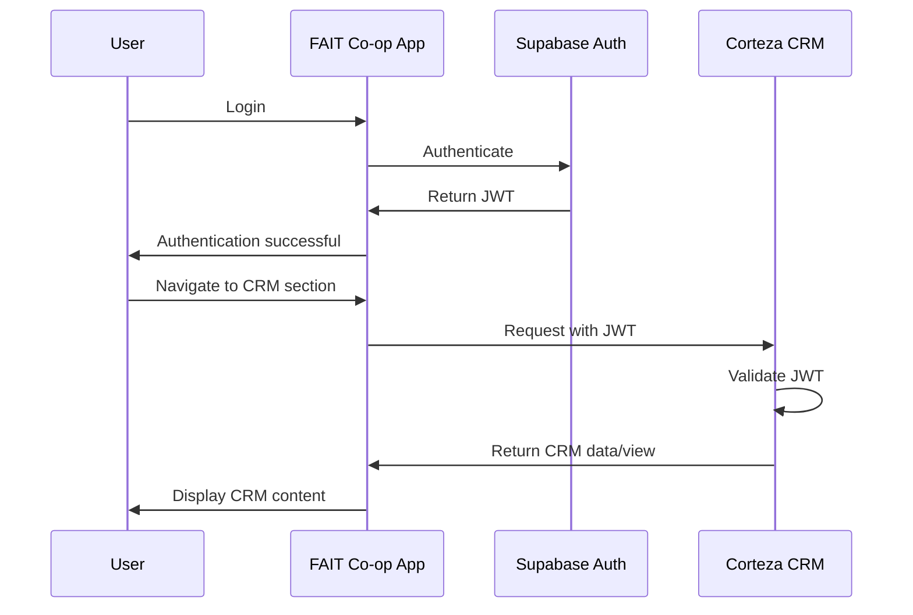

# Corteza CRM Integration Plan

This document provides a detailed technical plan for integrating Corteza CRM with the FAIT Co-op platform, specifically designed to support our growth strategy implementation.

## Overview

Corteza is an open-source, cloud-based CRM and Low-Code Application Platform built on a modern technology stack (Go, Vue.js, PostgreSQL) that aligns well with our existing FAIT Co-op platform (React, TypeScript, Supabase/PostgreSQL). This integration will serve as a critical component of our Phase 2: Expansion growth strategy, enabling advanced member relationship management, referral tracking, and community engagement features.

## Technical Architecture

### Deployment Architecture

```
┌─────────────────────┐     ┌─────────────────────┐
│                     │     │                     │
│   FAIT Co-op        │     │   Corteza CRM       │
│   Platform          │     │   Platform          │
│                     │     │                     │
│   - React           │◄────┼───►- Vue.js         │
│   - TypeScript      │     │    - Go             │
│   - Supabase        │◄────┼───►- PostgreSQL     │
│                     │     │                     │
└─────────────────────┘     └─────────────────────┘
         ▲                            ▲
         │                            │
         │                            │
         ▼                            ▼
┌─────────────────────────────────────────────────┐
│                                                 │
│              Shared PostgreSQL                  │
│              (Optional)                         │
│                                                 │
└─────────────────────────────────────────────────┘
```

### Integration Points

1. **Database Integration**
   - Option 1: Shared PostgreSQL database with separate schemas
   - Option 2: Separate databases with API-based synchronization

2. **Authentication Integration**
   - Implement SSO using JWT tokens
   - Share user sessions between platforms

3. **UI Integration**
   - Embed Corteza components in React using iframes or web components
   - Create custom React components that interact with Corteza's API

4. **API Integration**
   - Create middleware to translate between Corteza API and FAIT Co-op API
   - Implement webhooks for real-time updates

## Implementation Plan

### Phase 1: Infrastructure Setup (2 weeks)

1. **Server Provisioning**
   - Set up Corteza server in our cloud environment
   - Configure networking and security

2. **Database Configuration**
   - Set up PostgreSQL database for Corteza
   - Configure connection parameters
   - Implement backup and monitoring

3. **Initial Corteza Configuration**
   - Install and configure Corteza
   - Set up admin accounts
   - Configure basic security settings

### Phase 2: Data Model Configuration (3 weeks)

1. **Core Data Models**
   - Configure Contact module with custom fields for clients and service agents
   - Configure Organization module for business clients
   - Configure Opportunity module for potential projects
   - Configure Activity module for tracking interactions

2. **Growth Strategy Models**
   - Create Referral module for tracking member referrals
   - Create Contribution module for tracking member engagement
   - Create Badge/Achievement module for gamification elements
   - Create Ambassador module for managing program participants

3. **Construction-Specific Models**
   - Create Project module linked to Opportunities
   - Create Estimate module linked to Projects
   - Create Warranty module linked to Projects
   - Create Service History module

4. **Relationships and Workflows**
   - Configure relationships between modules
   - Set up basic workflows for lead-to-project conversion
   - Configure validation rules and triggers
   - Create referral attribution and reward workflows

### Phase 3: Authentication Integration (2 weeks)

1. **SSO Implementation**
   - Configure Corteza to accept JWT tokens from Supabase
   - Implement token validation and user mapping
   - Create user synchronization process

2. **User Management**
   - Implement user provisioning from FAIT Co-op to Corteza
   - Configure role mapping between systems
   - Set up permission synchronization

### Phase 4: API Integration (4 weeks)

1. **API Mapping**
   - Document all relevant APIs from both systems
   - Create mapping between data models
   - Implement transformation logic

2. **Synchronization Services**
   - Develop bidirectional sync for contacts/profiles
   - Develop bidirectional sync for projects/opportunities
   - Develop bidirectional sync for estimates/quotes
   - Implement conflict resolution strategies

3. **Webhook Implementation**
   - Configure webhooks in both systems
   - Implement event handlers for real-time updates
   - Set up retry and error handling

### Phase 5: UI Integration (3 weeks)

1. **Embedded Views**
   - Create React components to embed Corteza views
   - Implement context passing between applications
   - Style integration for consistent look and feel

2. **Navigation Integration**
   - Add CRM navigation items to FAIT Co-op menu
   - Implement deep linking between applications
   - Create unified breadcrumb navigation

3. **Notification Integration**
   - Integrate Corteza notifications into FAIT Co-op notification center
   - Implement unified notification preferences

### Phase 6: Growth Strategy Features (4 weeks)

1. **Gamification and Rewards**
   - Implement points tracking and calculation system
   - Configure achievement and badge automation
   - Set up member tier progression rules
   - Create leaderboards for various contribution categories

2. **Referral and Ambassador Programs**
   - Configure referral tracking and attribution
   - Set up automated reward distribution
   - Implement ambassador program management
   - Create ambassador performance dashboards

3. **Community Engagement**
   - Set up geographic chapter management
   - Implement civic contribution tracking
   - Create community event management
   - Develop community health metrics

4. **Reporting and Analytics**
   - Create growth metrics dashboards
   - Implement member engagement scoring
   - Set up referral conversion reporting
   - Develop community contribution analytics

### Phase 7: Testing and Deployment (2 weeks)

1. **Integration Testing**
   - Test all integration points
   - Verify data synchronization
   - Test authentication flows
   - Validate UI integration

2. **Performance Testing**
   - Test system under load
   - Optimize database queries
   - Implement caching where needed

3. **Deployment**
   - Create deployment plan
   - Set up staging environment
   - Implement rollback procedures
   - Deploy to production

## Technical Considerations

### Database Schema

If using a shared database approach, we'll need to carefully design the schema to avoid conflicts:

```sql
-- Example schema for shared database
CREATE SCHEMA fait_platform;
CREATE SCHEMA corteza_crm;

-- Grant permissions
GRANT USAGE ON SCHEMA fait_platform TO corteza_user;
GRANT USAGE ON SCHEMA corteza_crm TO fait_user;

-- Create views for cross-schema access
CREATE VIEW fait_platform.crm_contacts AS
  SELECT * FROM corteza_crm.contacts;
```

### API Integration

Example of API middleware for translating between systems:

```typescript
// Example middleware for translating between Corteza and FAIT Co-op
async function translateContact(cortezaContact: CortezaContact): Promise<FaitProfile> {
  return {
    id: cortezaContact.recordID,
    first_name: cortezaContact.values.firstName,
    last_name: cortezaContact.values.lastName,
    email: cortezaContact.values.email,
    phone: cortezaContact.values.phone,
    user_type: mapUserType(cortezaContact.values.contactType),
    // ... other mappings
  };
}

// Example webhook handler
app.post('/webhooks/corteza/contact', async (req, res) => {
  const cortezaContact = req.body;
  const faitProfile = await translateContact(cortezaContact);

  // Update FAIT Co-op profile
  await supabase
    .from('profiles')
    .upsert(faitProfile);

  res.status(200).send('OK');
});
```

### Authentication Flow



## Security Considerations

1. **Data Protection**
   - Ensure PII is properly protected in both systems
   - Implement field-level encryption for sensitive data
   - Configure appropriate access controls

2. **API Security**
   - Use HTTPS for all communications
   - Implement rate limiting
   - Use API keys and JWT tokens for authentication
   - Validate all inputs

3. **Audit Logging**
   - Log all cross-system operations
   - Implement audit trails for data modifications
   - Set up alerts for suspicious activities

## Rollout Strategy

1. **Alpha Phase (Internal Users)**
   - Deploy to internal team
   - Test with real data
   - Gather feedback and make adjustments

2. **Beta Phase (Selected Users)**
   - Invite select service agents and clients
   - Monitor performance and usage
   - Collect feedback through surveys

3. **General Availability**
   - Roll out to all users
   - Provide training materials
   - Implement support processes

## Success Metrics

1. **Technical Metrics**
   - API response times < 200ms
   - Data synchronization latency < 5 minutes
   - System uptime > 99.9%
   - Error rate < 0.1%

2. **Growth Strategy Metrics**
   - Increase in referral conversion rate by 25%
   - Growth in member-to-member referrals by 30%
   - Improvement in member retention by 20%
   - Increase in ambassador program participation by 15%
   - Growth in community engagement metrics by 25%

3. **Business Metrics**
   - Increased lead conversion rate by 15%
   - Reduced time from initial contact to project start by 20%
   - Improved client retention by 10%
   - Enhanced visibility into member contributions (qualitative)

## Resources

### Team Requirements

- 1 Backend Developer (Go/PostgreSQL)
- 1 Frontend Developer (React/Vue.js)
- 1 DevOps Engineer
- 1 Project Manager
- Part-time QA Engineer

### External Resources

- Corteza documentation: https://docs.cortezaproject.org/
- Corteza API reference: https://api.cortezaproject.org/
- Corteza GitHub repository: https://github.com/cortezaproject/corteza-server

## Timeline

Total estimated time: 20 weeks (5 months)

- Phase 1: Infrastructure Setup - Weeks 1-2
- Phase 2: Data Model Configuration - Weeks 3-5
- Phase 3: Authentication Integration - Weeks 6-7
- Phase 4: API Integration - Weeks 8-11
- Phase 5: UI Integration - Weeks 12-14
- Phase 6: Advanced Features - Weeks 15-18
- Phase 7: Testing and Deployment - Weeks 19-20

## Risks and Mitigations

| Risk | Impact | Likelihood | Mitigation |
|------|--------|------------|------------|
| Database schema conflicts | High | Medium | Use separate schemas, implement thorough testing |
| Authentication issues | High | Low | Implement fallback authentication, thorough testing |
| Performance bottlenecks | Medium | Medium | Performance testing, caching, optimization |
| Data synchronization conflicts | High | Medium | Implement conflict resolution, audit logging |
| User adoption resistance | Medium | Medium | Training, phased rollout, gather feedback |

## Alignment with Growth Strategy

This Corteza CRM integration is strategically aligned with our three-phase growth strategy:

### Phase 1: Foundation
- Supports the verification system for service agents
- Enables tracking of referral programs
- Provides infrastructure for basic points and achievement systems
- Facilitates community forum management

### Phase 2: Expansion
- Powers the tiered community rewards system
- Enables comprehensive contribution scoring
- Supports ambassador program management
- Facilitates civic engagement tracking
- Provides framework for geographic chapter management

### Phase 3: Optimization
- Enables advanced incentive models
- Supports partnership ecosystem development
- Provides data for behavioral optimization
- Facilitates co-op governance integration
- Powers growth loops enhancement

## Conclusion

The Corteza CRM integration will provide FAIT Co-op with a comprehensive relationship management system that integrates seamlessly with our existing platform and directly supports our growth strategy. By leveraging Corteza's modern architecture and our existing technology stack, we can create a unified experience for our members while enhancing our community-building capabilities.

This integration will support our long-term vision of providing a complete platform for service agents and clients in the construction industry, with enhanced community engagement, referral management, and member relationship features that align with our cooperative values.
